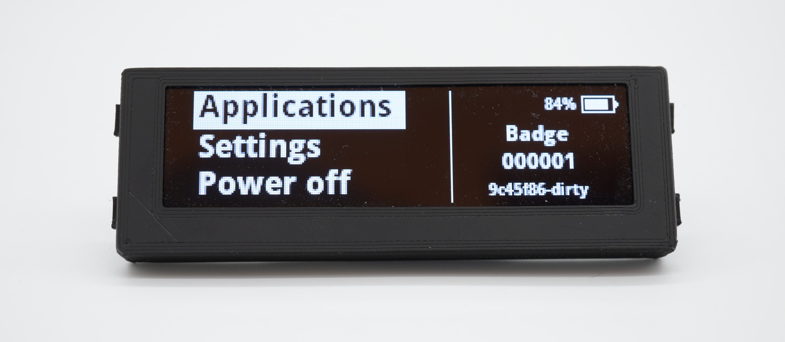
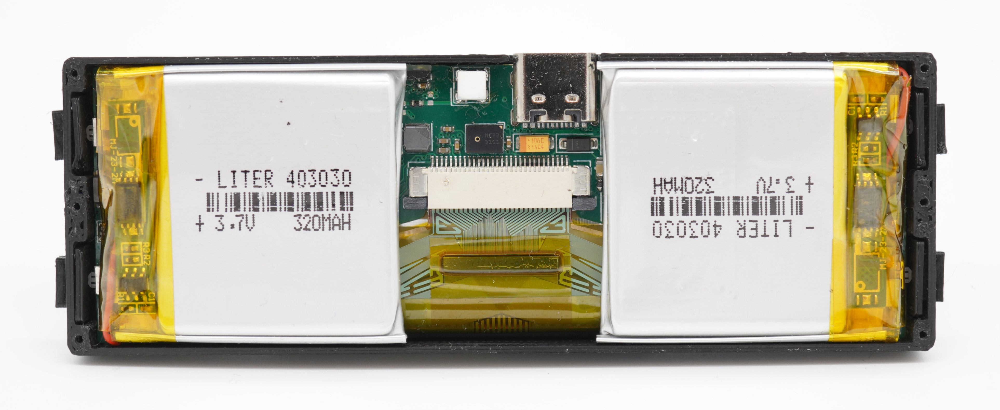

OLED Nametag
============

This repository contains the design file for a fully open source
electronic name badge with monochrome OLED display.  

**I would not recommend ordering RevA yet as there are a number of
issues with that version. See
[Rev A issues](https://github.com/TobleMiner/oled-nametag#rev-a-issues)
for details.**

# Features

 - Bright, sunlight readable OLED display
 - Infinity constrast ratio
 - Support for GIF animations
 - WLAN AP support
 - Web interface for management of animations
 - Automatic brightness adjustment
 - 8h+ runtime

# Construction

All fabrication files are located in `fab`.  

## PCB

The main PCB have been optimized for manufacturing through JLCPCB.  
Most components can also be assmbled by JLCPCB directly.  

## Display

The display used can be one of:
 - UG-5664ALBEF01
 - UG-5664ASWEF01
 - ER-OLED032-1 (all variants)

Other menchanically compatible SSD1322-based parts can also be used.

## Housing

The device housing is 3D printable and designed to suit most 3D printing
processes, especially SLA and FDM. Good results have also been achieved with
MJF and SLS printing.  

There are three different fabrication files for the case top part,
depending on the thickness of the lithium batteries used.  

Additionally 4 button actuators need to be printed for each OLED badge.
Those are also contained in the OpenSCAD design files and fabrication
output.

# Assembly

## PCB

When choosing PCB assembly through JLCPCB only two PCB components need to
be assmbled manually:
 - WLAN antenna (AE1)
 - Ambient light sensor (U4)

## Display

The display is mounted to the top side of the PCB using double sided
adhesive tape with a thickness of .15mm. Align to top of the PCB (side
with USB-C port) with the top of the display.

## Batteries

The device needs two 303030, 403030 or 503030 cells as a power source.  
The batteries need to be mounted on the bottom side of the PCB. Double-
sided adhesive foam tape with a thickness of 2mm is recommended for this
purpose.

## Housing

Place the button actuators into the housing first, then slide in the PCB
with both display and batteries attached and stuck down.  

At this point the badge should look like this:  

Finally screw on the top lid iwht six 4mm M1 fine thread self tapping
screws.

# Firmware

The OLED badge is running fully Open Source firmware. For the purpose of
enabling WLAN connectivity vendor-provided binary blobs are required.  
The firmware source can be found here:  
[https://github.com/TobleMiner/oled-nametag-firmware](https://github.com/TobleMiner/oled-nametag-firmware)

# Rev A issues

Rev A is very much a prototype. It has the following known issues:
 - USB D- and D+ are swapped on the ESP32-S3, needs bodge to swap data lines
 - OLED SPI mode is inconvenient and incompatible with current firmware, connect R1 to GND
 - R21 is too large, preventing soft power down, replace with 1k

The current state of the repository does not reflect Rev A but a
potential Rev B. Please note that this state of the design has not been
tested yet.
